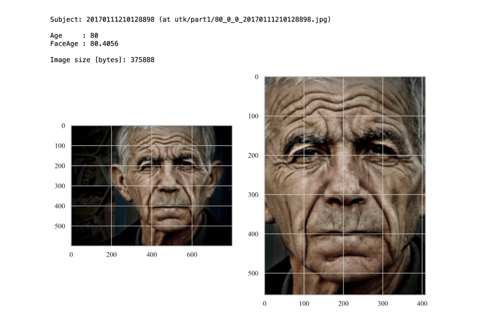
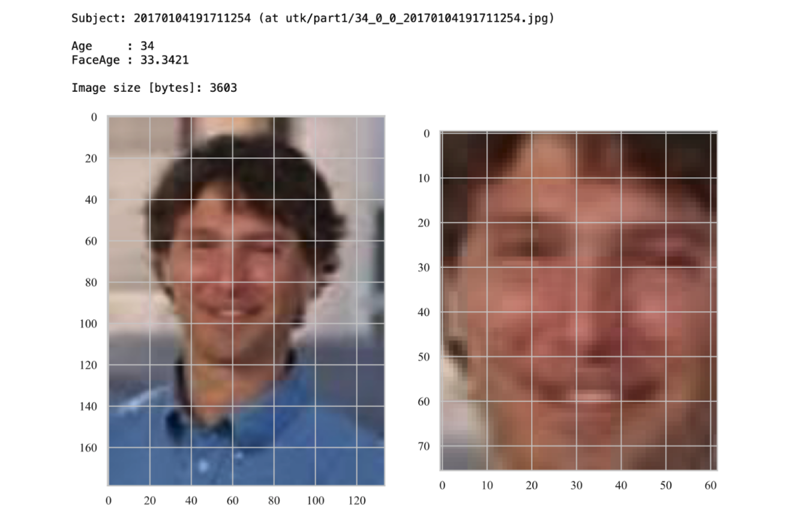

# FaceAge

Decoding Biological Age from Face Photographs using Deep Learning

If you use code or parts of this code in your work, please cite our publication:

_Osbert Zalay, Dennis Bontempi, Danielle S. Bitterman, Nicolai Birkbak, Jack M. Qian, Hannah Roberts, Subha Perni, Andre Dekker, Tracy Balboni, Laura Warren, Monica Krishan, Benjamin H. Kann, Charles Swanton, Dirk De Ruysscher, Raymond H. Mak, Hugo J.W.L. Aerts - Decoding biological age from face photographs using deep learning_ (submitted).


## Table of Contents

- [FaceAge](#faceage)
    - [Repository Structure](#repository-structure)
    - [Environment Setup and Dependencies](#environment-setup-and-dependencies)
        - [Running the Pipeline on a Machine Equipped With a Gpu](#running-the-pipeline-on-a-machine-equipped-with-a-gpu)
        - [Running the Pipeline on a Machine Without a Gpu](#running-the-pipeline-on-a-machine-without-a-gpu)
    - [Acknowledgements](#acknowledgements)
    - [Disclaimer](#disclaimer)
- [Data](#data)
    - [Augmentation and Rebalancing](#augmentation-and-rebalancing)
    - [Database Processing](#database-processing)
    - [Database Curation](#database-curation)
    - [Survey Data Processing](#survey-data-processing)
    - [Manual Quality Assurance](#manual-quality-assurance)
        - [Example of Acceptable Image](#example-of-acceptable-image)
        - [Example of Disqualified Image](#example-of-disqualified-image)
    - [Link to the Shared Data](#link-to-the-shared-data)
- [Models](#models)
    - [Model Description](#model-description)
    - [Model Training and Performance](#model-training-and-performance)
    - [Model Validation](#model-validation)
        - [Comments on Fine-tuning and Bias](#comments-on-fine-tuning-and-bias)
- [Output](#output)
- [Notebooks](#notebooks)
    - [Data Processing Demo](#data-processing-demo)
    - [Extended Data Plots Demo](#extended-data-plots-demo)
- [Source Code](#source-code)
    - [Testing Code](#testing-code)
- [Statistical Analysis Code](#statistical-analysis-code)


## Repository Structure

This repository is structured as follows:

* The `src` folder stores the code used to train and test the pipeline;
* The `stats` folder stores the code used in the statistical analysis, and to export the plots in the Main Manuscript and in the Extended Data;
* The `models` folder stores the pre-trained weights for the FaceAge model;
* The `data` folder stores the code used for data processing (from the database curation to the processing of some of the results, e.g., the survey in Figure 4 of the Main Manuscript), along with the links to retrieve the data shared with the publication;
* The `outputs` folder stores a sample of the output from the pipeline;
* The `notebooks` folder stores some demo resources useful to understand how the pipeline works and reproduce the first figures in the Extended Data.

Additional details on the content of the subdirectories and their structure can be found in the markdown files stored in each of the subdirectories.


## Environment Setup and Dependencies

The original code was developed and tested using Python 3.6.5 on Ubuntu 18.04 with Tensorflow-gpu 1.8.0 and CUDA 9.1.85. An online version of the pipeline was also tested using the environment described in the `environment-gpu.yaml` file (Python 3.6.13, CUDA 11.3.1, and libcudnn 8.2.1 - on Ubuntu 18.04), the environment described in `environment-cpu.yaml` (i.e., the same packages - but without GPU acceleration), and using the freely accessible Google Colab notebook (Python 3.7.12, CUDA 11.1, and libcudnn 7.6.5 - on Ubuntu 18.04). We recommend running the pipeline on an up-to-date environment to avoid [known problems](https://github.com/ipazc/mtcnn/issues/87) with the `MTCNN` library. The statistical analysis was conducted using R (Version 3.6.3) in an RStudio environment (Version 1.4.1106).

For the code to run as intended, the all the packages under one of the environment files should be installed. In order not to break previous installations and ensure full compatibility, it's highly recommended to create a Conda environment to run the FaceAge pipeline in. Here follows two examples of the set-up procedure using Conda and one of the provided YAML environment files.

### Running the Pipeline on a Machine Equipped With a Gpu

GPU acceleration can speed up the FaceAge estimation dramatically. If your machine is equipped with a GPU that supports CUDA compute capability, you can set up the Conda environment running the following:

```
# set-up Conda faceage-test environment
conda env create --file environment-gpu.yaml

# activate the conda environment
conda activate faceage-gpu
```

At this point, `(faceage-gpu)` should be displayed at the start of each bash line. Furthermore, the command `which python` should return a path similar to `$PATH_TO_CONDA_FOLDER/faceage-gpu/bin/python`. You can check your GPU is correctly identified by the environment (and thus, the GPU acceleration available) by spawning a `python` shell (after activating the Conda environment), and running:

```
import tensorflow as tf
tf.config.list_physical_devices('GPU')
```

If the set-up was successful, you should get an output similar to the following:

```
>>> tensorflow.config.list_physical_devices('GPU')
[PhysicalDevice(name='/physical_device:GPU:0', device_type='GPU')]
```

Everything should now be ready for the data to be processed by the FaceAge pipeline.

The virtual environment can be deactivated by running:

```
conda deactivate
```

### Running the Pipeline on a Machine Without a Gpu

Running the FaceAge pipeline without GPU acceleration is possible, although this might increase considerably the processing times. If your machine is not equipped with a GPU that supports CUDA compute capability, you can set up the Conda environment running the following:

```
# set-up Conda faceage-test environment
conda env create --file environment-cpu.yaml

# activate the conda environment
conda activate faceage-cpu
```

At this point, `(faceage-cpu)` should be displayed at the start of each bash line. Furthermore, the command `which python` should return a path similar to `$PATH_TO_CONDA_FOLDER/faceage-cpu/bin/python`. Everything should now be ready for the data to be processed by the FaceAge pipeline.

The virtual environment can be deactivated by running:

```
conda deactivate
```


## Acknowledgements

Code development, testing, and documentation: Osbert Zalay and Dennis Bontempi.


## Disclaimer

The code and data of this repository are provided to promote reproducible research. They are not intended for clinical care or commercial use.

The software is provided "as is", without warranty of any kind, express or implied, including but not limited to the warranties of merchantability, fitness for a particular purpose and noninfringement. In no event shall the authors or copyright holders be liable for any claim, damages or other liability, whether in an action of contract, tort or otherwise, arising from, out of or in connection with the software or the use or other dealings in the software.


# Data

The `data` folder contains data processing and quality assurance files, used to prepare the clinical (HARVARD) and model development datasets. A description of each file is provided below. This README also contains the links to retrieve the data shared with the publication.

## Augmentation and Rebalancing

The script takes the source database of age-labelled photographs and creates a balanced dataset for model training and development via augmentation and randomized rebalancing. The user defines a target number of samples per age category, age range of the processed dataset, and batch size for augmentation. The augmentation is done using the ImageDataGenerator functionality in Keras:5

```
# example instantiation of ImageDataGenerator object for augmentation
datagen = ImageDataGenerator(
        # paramaters for augmentation (shifts, rotations, flips, shear, etc.)
        samplewise_center = False,
        samplewise_std_normalization = False,
        rotation_range=20,
        width_shift_range=0.1,
        height_shift_range=0.1,
        shear_range=0.2,
        zoom_range=0.2,
        horizontal_flip=True,
        fill_mode='constant')
```

The randomized rebalancing randomly shuffles samples from each each category to supplement the augmented samples until the target number of samples per age category is achieved, in order to achieve an approximate uniform distribution

<p align="center">
  
</p>


## Database Processing

The script takes `logfile.csv`, which contains the clinical image hashes pertaining to patient photographs stored on the hospital EMR, and maps them to the clinical database of respective patient prognostic factors and outcomes collectively prospectively; e.g. stored on `REDcap` clinical data e-repository at Harvard MGH/BWH. No clinical information is provided in this repo (including the contents of `logfile.csv`) due to privacy conditions.


## Database Curation

This script applies inclusion and exclusion criteria (as described in the manuscript) to the output of `Database_Processing.py` and calculates survival times, follow-up times and events in order to obtain the curated database used for statistical and survival analyses.


## Survey Data Processing

This script was used to import the human survey data from part 1 and 2 (stored on `REDcap` clinical data e-repository at Harvard MGH/BWH; see manuscript for further details) and map those to respective patient prognostic factors and outcomes, to create an output `.csv` file used for statistical analyses of survey results that compares human performance to machine performance in survival prediction for palliative cancer patients.


## Manual Quality Assurance

This script was used to manually cull images that met the photo QA exclusion criteria listed in the manuscript.

<p align="center">
  
</p>

<br>
<br>

### Example of Acceptable Image

<p align="center">
  
</p>


<br>

### Example of Disqualified Image

Exclusion reason: the original image, and therefore the cropped face, is of too-low quality.

<p align="center">
  
</p>


## Link to the Shared Data

A link to the data (all the data used for training purposes, and the curated portion of the UTK dataset used for validation purposes) will be shared here upon publication. We plan to make these resources openly available to the community through [Zenodo.org](https://zenodo.org).

For the time being, to ease the review process, the datasets are available at [this Google Drive link](https://drive.google.com/drive/folders/1C2n7KekfbthDFt0t8vbVpD_lEh5lYFyj?usp=sharing). To ensure the review process stays confidential, we ask reviewers to visit this webpage in private/incognito mode, or log-out of their Google account beforehand. In this way, it is impossible for us to monitor who accesses the Google Drive folders.


# Models

The pre-trained weights will be made available upon publication of the study via [Zenodo](https://zenodo.org).

For the time being, to ease the review process, the model weights are available at [this Google Drive link](https://drive.google.com/file/d/1KBZBMKbeqDH95KMbPKJ6vFqnf3ze2aIn/view?usp=sharing). To ensure the review process stays confidential, we ask reviewers to visit this webpage in private/incognito mode, or log-out of their Google account beforehand. In this way, it is impossible for us to monitor who accesses the Google Drive folders.

## Model Description

The FaceAge deep learning pipeline comprises two stages: a face localization and extraction stage, and a feature embedding stage with output linear regressor that provides the continuous estimate of biological age.

<p align="center">
  
</p>

The first stage pre-processes the input data by locating the face within the photograph and defines a bounding box around it. The image is then cropped, resized, and pixel values standard-normalized across all RGB channels. Face extraction is accomplished using [a multi-task cascaded CNN (MTCNN)](https://github.com/ipazc/mtcnn) implemented by Zhang et al. (IEEE Signal Processing Letters 23, 1499–1503, 2016). The extraction network is comprised of three sub-networks, namely a proposal network (`P-net`) that creates an initial set of bounding box candidates, of which similar boxes are merged then further refined (`R-net`) using bounding box regression and face landmark localization, then the third stage (`O-net`) makes more stringent use of face landmarks to optimize the final bounding box, achieving a cited test accuracy of 95%. For additional details, please refer to the project repository.

The second stage of the pipeline takes the extracted face image and feeds it into a convolutional neural network (CNN) that encodes image features which through regression yield a continuous FaceAge prediction as the output. This model (whose pre-trained weights will be made available upon publication) uses an `Inception-ResNet v1` architecture, whose layers progressively embed higher-order facial features into lower-dimensional representations, yielding a 128-dimensional face embedding that is then fed through a linear regression layer to produce the continuous biological age estimate as the final output. The original `Inception-ResNet v1` [CNN weights were pre-trained on the problem of facial recognition by Sandberg](https://github.com/davidsandberg/facenet), whereby it achieved a test accuracy of 98% on the [`Local Faces in the Wild` database](http://vis-www.cs.umass.edu/lfw/results.html) (see project repository for details).

The network was adapted to biological age estimation by removing the output classification layer and replacing it with densely connected layers feeding a fully-connected output layer with linear activation function to perform the regression. Transfer learning was then applied to tune the weights of the last 281 of the 426 `Inception-ResNet v1` layers (Inception Block B1 onward) in addition to the fully-connected output layers, using the augmented and randomly rebalanced training dataset of N = 56,304 age-labelled face images derived from the `IMDb-Wiki` database (see [Augmentation and Rebalancing](#augmentation-and-rebalancing)). The photographs age-labeled from 60 years old and onward were manually curacted to ensure image quality control and reduce error from noisy labels for this clinically-relevant age group (see [Manual Quality Assurance](#manual-quality-assurance)). The following CONSORT-style diagram shows how the training dataset was constructed:

<p align="center">
  
</p>


## Model Training and Performance

Training was carried out on paired GPUs using `Keras` with `Tensorflow` backend, applying stochastic gradient descent with momentum for backpropagation, minimizing mean absolute error (MAE), with batch size of 256, batch normalization, dropout for regularization, and initial learning rate of 0.001 with incremental reduction on plateauing of error rate. The model development set was subdivided using random partitioning into 90% training, 10% testing. A description of the source code can be found in the dedicated README file.

Model performance was good for the age range that underwent manual curation and quality assurance (MAE = 4.09 years). Overall, MAE = 5.87 years for the entire dataset. This was deemed acceptable because the intent was on obtaining a better fit for ages 60 or older, being most clinically relevant to oncology populations, at the expense of not fitting the younger age range < 40 as well. Therefore, we accepted that images pertaining to the younger age labels contained higher heterogeneity, poorer image quality and some noisy or erroneous labels. Nevertheless, mean age difference was approximately zero for ages > 40, demonstrating the absence of an age bias in this clinically-relevant age range.


<br>
<br>

## Model Validation

Example model validation on an independent curated dataset derived from the `UTK` database [can be found here](https://drive.google.com/drive/folders/1N__o3t96KQr3PYOd_5XnVYfJUdhyQYQp?usp=sharing). The notebooks enable the user to reproduce some of the figures in the Extended Data section of the manuscript.


### Comments on Fine-tuning and Bias

The FaceAge model as implemented in the research study on clinical cancer populations did not have finetuning of model parameters. The reasons for foregoing finetuning are manifold, but most importantly we discerned introduction of age bias and overfitting when performing finetuning. Although finetuned FaceAge models could very accurately predict chronologic age for the test sample population of healthy controls, often with MAE < 3 years, when a finetuned model was applied to clinical datasets, prognostic power to discern patient outcomes typically diminished compared to the non-finetuned model:


Therefore, it was preferrable to utilize the non-finetuned model for biological age estimation and outcomes prognostication, despite the base model being "noisier" (i.e. possessing larger dispersion in estimated age range) than the finetuned model. The greater magnitude of dispersion between individuals was found to correlate with relative survival outcomes between patients in the cohort, and thus with biological age, whereby finetuning was found to weaken or eliminate this relational prognostic component, likely in part due to overfitting to the smaller sample size of the finetuning cohort. Bias was also introduced by the idiosyncracies of the fine-tunining dataset, such as by the fact that when humans estimate apparent age, they tend to underestimate the ages of older individuals - precisely in the age-range relevant to clinical oncology populations - with the bias becoming more pronounced with increasing age:


Of note, although we did not finetune the model for this study in order to avoid issues of overfitting and introducing age-related bias, this does not preclude us from doing so in future iterations of the model if we are able to mitigate the negative impacts of finetuning on clinical prognostication. This is an area of active research for our group.


# Output

The `output` folder stores a sample of the output from the FaceAge pipeline (`utk_hi-res_qa_res.csv`). This CSV file was obtained by processing the data folder `data/utk_hi-res_qa` (the data will be shared upon publication via [Zenodo](https://zenodo.org), and are temporarily available [at this link](https://drive.google.com/drive/folders/1OkFc74Izf_2b1kxtGWR7LCiA83-XvJfd?usp=sharing); to ensure the review process stays confidential, we ask reviewers to visit this webpage in private/incognito mode, or log-out of their Google account beforehand: in this way, it is impossible for us to monitor who accesses the Google Drive folders) using the demo script `predict_folder_demo.py` (with the default configuration stored in `config_predict_folder_demo.yaml`), found under the `src/test` subdirectory.

The `subj_id` column contains the file name (without the extension), while the `faceage` column contains the estimation of the subject biologic age computed by our pipeline:

|          subj_id          |  faceage  |
|---------------------------|-----------|
| 100_1_0_20170112213303693 | 94.32125  |
| 100_1_0_20170117195420803 | 95.265175 |
| 100_1_0_20170119212053665 | 98.09706  |
| ...                       | ...       |
| 51_0_0_20170117160754830  | 49.63042  |
| 51_0_0_20170117160756480  | 56.181442 |
| 51_0_0_20170117160807782  | 59.752483 |
| ...                       | ...       |
| 96_1_2_20170110182526540  | 91.92511  |
| 99_1_0_20170120133837030  | 92.09139  |
| 99_1_2_20170117195405372  | 95.592224 |

<br>

The CSV file `utk_hi-res_qa_res-ext_data.csv` is very similar to the aforementioned, but incorporates all the information needed to reproduce the first Extended Data figures. This CSV has been generated from the [Google Colab Notebook `data_processing_demo.ipynb`](https://colab.research.google.com/drive/15fUoyFsMF7yo--oQ_MZJe51J_RE9BjwE?usp=sharing):

|          subj_id          |  faceage  |  age  |  gender  |  race  |
|---------------------------|-----------|-------|----------|--------|
|     20170110153238490     | 75.026596 |  74   |   1      |   0    |
|     20170109213056053     | 28.754328 |  21   |   1      |   2    |
|     20170117012906285     | 48.943573 |  38   |   0      |   1    |
|     20170117151304315     | 30.146166 |  30   |   1      |   0    |
|     20170116200714834     | 45.974422 |  26   |   0      |   1    |
|     ...                   | ...       | ...   | ...      | ...    |


# Notebooks

The `notebook` folder stores some tutorial notebooks we developed to allow for quick experimentation with our pipeline.

The notebooks can be downloaded and run locally (provided the right environment is set up - see the main `README` for detailed instructions), or opened directly in Google Colab by clicking the "Open with Colab" buttons below.

## Data Processing Demo

[This Google Colab notebook](https://colab.research.google.com/drive/15fUoyFsMF7yo--oQ_MZJe51J_RE9BjwE?usp=sharing) is designed to showcase how the pipeline is set-up, how to format the input to the pipeline, and what to expect as its output - as well as estimate the computational costs of the operation involved.

The data required to run the notebook will be made available through [Zenodo](https://zenodo) upon publication. For the time being, to ease the review process, the datasets are available at [this Google Drive link](https://drive.google.com/drive/folders/1C2n7KekfbthDFt0t8vbVpD_lEh5lYFyj?usp=sharing). To ensure the review process stays confidential, we ask reviewers to visit this webpage in private/incognito mode, or log-out of their Google account beforehand. In this way, it is impossible for us to monitor who accesses the Google Drive folders.


Here follows a sample from the notebook:

<p align="center">
  
</p>

```
Age:      62
FaceAge:  63.252663

Gender:   0 (Male)
Race:     0 (White)
```

## Extended Data Plots Demo

[This Google Colab notebook](https://colab.research.google.com/drive/1EPBcbD1nZ_WVJ-G7giXSIb4sr9GEV6M2?usp=sharing) allows the user to reproduce some of the figures in the Extended Data document.

Note that any small difference in the quantitative results is due to a difference between the versions of the dependencies used to conduct the final analysis in the paper, and the version of such dependencies on Google Colab.

Here follows a sample from the notebook:

<br>

<p align="center">
  
</p>


# Source Code

The `src` folder stores the code used to train and test the pipeline.

A list of the pipeline dependencies, as well as a quick guide on how to set-up the environment to run the pipeline, can be found in the main `README`.


# Testing Code

In the `test` folder, we provide a simple script (`predict_folder_demo.py`) to process all the `.jpg` and `.png` files in a given directory.

By default, the script reads the images to process from a folder whose name is specified in the `config_predict_folder_demo.yaml` configuration file (`input_folder_name`). The absolute path to the folder is determined from `base_path` and `data_folder_name` as well (by default, the script will look for a folder at `$base_path/$data_folder_name/$input_folder_name`):

```
$base_path
└── $data_folder_name
    └── $input_folder_name
        ├── subj1.jpg
        ├── subj2.jpg
        ├── subj3.jpg
        ...
```

The folder can contain files that are not `.png` and `.jpg`, as only these formats will be read and processed. Here follows an example of how a folder should look like:

```
~/git/FaceAge
└── data
    └── utk_hi-res_qa
        ├── 100_1_0_20170112213303693.jpg
        ├── 100_1_0_20170117195420803.jpg
        ├── 100_1_0_20170119212053665.jpg
        ├── 20_0_0_20170104230051977.jpg
        ├── 20_0_0_20170110232156775.jpg
        ├── 20_0_0_20170117134213422.jpg
        ├── 20_0_0_20170117140056058.jpg
        ...
```
The `config_predict_folder_demo.yaml` configuration file is parsed by the script to determine also the path to the pre-trained model file (`$base_path/$models_folder_name/$model_name`), and the path to the folder where outputs (predictions) will be stored (`$base_path/$outputs_folder_name` - by default, stored under `${input_folder_name}.csv`).

A documented [Google Colab notebook implementing very similar operations](https://colab.research.google.com/drive/15fUoyFsMF7yo--oQ_MZJe51J_RE9BjwE?usp=sharing) is provided as part of the repository. The code can be easily adapted to suit the users need.

Here follows a sample output from the `predict_folder_demo.py` script, executed on a machine equipped with a NVIDIA TITAN RTX, after setting up from scratch the `faceage-gpu` Conda environment:

```
(faceage-gpu) dennis@R2-D2:~/git/FaceAge/src/test$ python -W ignore predict_folder_demo.py
Python version     :  3.6.13 |Anaconda, Inc.| (default, Jun  4 2021, 14:25:59)
TensorFlow version :  2.6.2
Keras version      :  2.6.0
Numpy version      :  1.19.5

Predicting FaceAge for 2547 subjects at: '/home/dennis/git/FaceAge/data/utk_hi-res_qa'

(2547/2547) Running the face localization step for "28_0_4_20170117202427928.jpg""
... Done in 2013.39 seconds.

(2547/2547) Running the age estimation step for "28_0_4_20170117202427928""
... Done in 95.157 seconds.

Saving predictions at: '/home/dennis/git/FaceAge/outputs/utk_hi-res_qa_res.csv'... Done.
```

Finally, here follows the output of `predict_folder_demo.py` ran on the same machine, without exploiting the GPU (rather, using an AMD Ryzen 7 3800X 8-Core; the system is equipped with 64 GBs of RAM). Given the system specifications, the nature of the operations involved and the lightweight models, the performances during the inference phase are comparable:

```
(faceage-cpu) dennis@R2-D2:~/git/FaceAge/src/test$ python -W ignore predict_folder_demo.py
Python version     :  3.6.13 |Anaconda, Inc.| (default, Jun  4 2021, 14:25:59)
TensorFlow version :  2.6.2
Keras version      :  2.6.0
Numpy version      :  1.19.5

Predicting FaceAge for 2547 subjects at: '/home/dennis/git/FaceAge/data/utk_hi-res_qa'

(2547/2547) Running the face localization step for "28_0_4_20170117202427928.jpg""
... Done in 1773.17 seconds.

(2547/2547) Running the age estimation step for "28_0_4_20170117202427928""
... Done in 108.407 seconds.

Saving predictions at: '/home/dennis/git/FaceAge/outputs/utk_hi-res_qa_res.csv'... Done.
```

# Statistical Analysis Code

The `stats` folder contains all the code used to generate the plots from the Main Manuscript (`main`) and the Extended Data (`extended`).

Statistical and survival analyses were performed in Python 3.6.5 using the [Lifelines library](https://github.com/CamDavidsonPilon/lifelines), as well as NumPy and SciPy libraries, and in the open-source statistical software platform, R.

The clinical endpoint was overall survival (OS). Actuarial survival curves for stratification of risk groups by overall survival were plotted using the Kaplan Meier (KM) approach, right-censoring patients who did not have the event or were lost to follow-up. All hypothesis testing performed in the study was two-sided, and paired tests were implemented when evaluating model predictions against the performance of a comparator for the same data samples. Differences in KM survival curves between risk groups were assessed using the log-rank test. Univariable and multivariable analysis via the Cox proportional hazards (PH) model was carried out to adjust for the effect of clinical covariates such as gender, disease site, smoking status, performance status and treatment intent. ROC analysis for area-under-the-curve (AUC) and concordance index (C-index) were also performed to assess model performance, and to compare against human performance in predicting survival outcomes.
