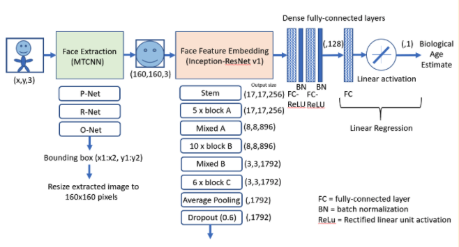

# Models

This folder should store the pre-trained weights of the FaceAge model (`faceage_model.h5`).

The pre-trained weights will be made available upon publication via [Zenodo](https://zenodo.org).

# Model Description

The FaceAge deep learning pipeline comprises two stages: a face location , and a feature encoding stage.

The first stage pre-processes the input data by locating the face within the photograph and defines a bounding box around it. The image is then cropped, resized, and normalized it. The face extraction is done using [a multi-task cascaded CNN (MTCNN)](https://github.com/ipazc/mtcnn) consisting of three sub-networks, P-Net, R-Net and O-Net. For additional details, please refer to the project repository.

The second stage of the pipeline takes the extracted face image and feeds it into a convolutional neural network (CNN) that encodes image features, which through regression yield a continuous FaceAge prediction as the output. This model (whose pre-trained weights will be made available upon publication) uses an inception-ResNet v1 architecture, whose layers progressively embed higher-order facial features into lower-dimensional representations, yielding a 128-dimensional face embedding that is then fed through a linear regression layer to produce the continuous biological age estimate as the final output.
