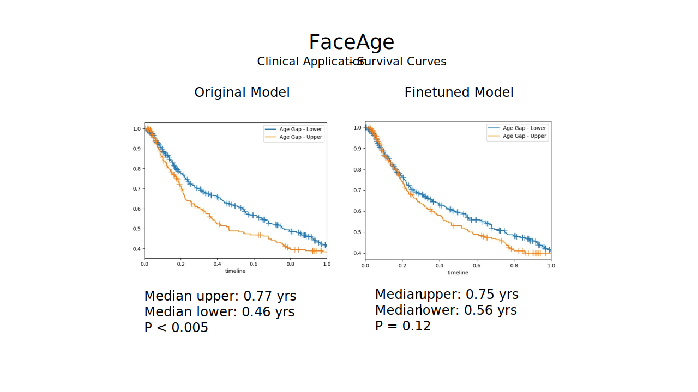
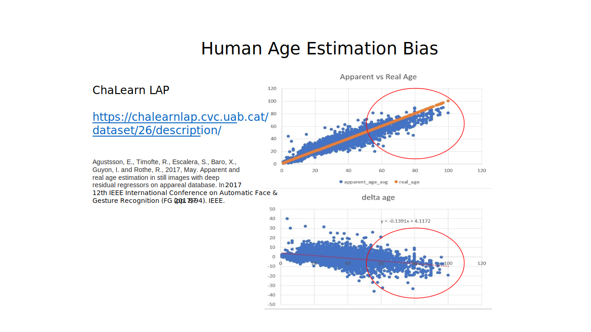

# Models

This folder was originally intended to store the pre-trained weights of the FaceAge model (`faceage_model.h5`). However, the pre-trained weights will be made available upon publication of the study via [Zenodo](https://zenodo.org).

## Model Description

The FaceAge deep learning pipeline comprises two stages: a face localization and extraction stage, and a feature embedding stage with output linear regressor that provides the continuous estimate of biological age.

The first stage pre-processes the input data by locating the face within the photograph and defines a bounding box around it. The image is then cropped, resized, and pixel values standard-normalized across all RGB channels. Face extraction is accomplished using [a multi-task cascaded CNN (MTCNN)](https://github.com/ipazc/mtcnn) implemented by Zhang et al. (IEEE Signal Processing Letters 23, 1499–1503, 2016). The extraction network is comprised of three sub-networks, namely a proposal network (`P-net`) that creates an initial set of bounding box candidates, of which similar boxes are merged then further refined (`R-net`) using bounding box regression and face landmark localization, then the third stage (`O-net`) makes more stringent use of face landmarks to optimize the final bounding box, achieving a cited test accuracy of 95%. For additional details, please refer to the project repository.

The second stage of the pipeline takes the extracted face image and feeds it into a convolutional neural network (CNN) that encodes image features which through regression yield a continuous FaceAge prediction as the output. This model (whose pre-trained weights will be made available upon publication) uses an `Inception-ResNet v1` architecture, whose layers progressively embed higher-order facial features into lower-dimensional representations, yielding a 128-dimensional face embedding that is then fed through a linear regression layer to produce the continuous biological age estimate as the final output. The original `Inception-ResNet v1` CNN weights were pre-trained on the problem of facial recognition by Sandberg (https://github.com/davidsandberg/facenet), whereby it achieved a test accuracy of 98% on the `Local Faces in the Wild` database (http://vis-www.cs.umass.edu/lfw/results.html) (see project repository for details). 

The network was adapted to biological age estimation by removing the output classification layer and replacing it with densely connected layers feeding a fully-connected output layer with linear activation function to perform the regression. Transfer learning was then applied to tune the weights of the last 281 of the 426 `Inception-ResNet v1` layers (Inception Block B1 onward) in addition to the fully-connected output layers, using the augmented and randomly rebalanced training dataset of N = 56,304 age-labelled face images derived from the `IMDb-Wiki` database (see [Augmentation and Rebalancing](../data#augmentation-and-rebalancing)). The photographs age-labeled from 60 years old and onward were manually curacted to ensure image quality control and reduce error from noisy labels for this clinically-relevant age group (see [Manual Quality Assurance](../data#manual-quality-assurance)). The following CONSORT-style diagram shows how the training dataset was constructed:

## Model Training and Performance

Training was carried out on paired GPUs using `Keras` with `Tensorflow` backend, applying stochastic gradient descent with momentum for backpropagation, minimizing mean absolute error (MAE), with batch size of 256, batch normalization, dropout for regularization, and initial learning rate of 0.001 with incremental reduction on plateauing of error rate. The model development set was subdivided using random partitioning into 90% training, 10% testing. A description of training and testing source code can be found here: [Model Development Code](../src#readme). Model performance was good for the age range that underwent manual curation and quality assurance (MAE = 4.09 years). Overall, MAE = 5.87 years for the entire dataset. This was deemed acceptable because the intent was on obtaining a better fit for ages 60 or older, being most clinically relevant to oncology populations, at the expense of not fitting the younger age range < 40 as well. Therefore, we accepted that images pertaining to the younger age labels contained higher heterogeneity, poorer image quality and some noisy or erroneous labels. Nevertheless, mean age difference was approximately zero for ages > 40, demonstrating the absence of an age bias in this clinically-relevant age range.

## Model Validation

Example model validation on an independent curated dataset derived from the `UTK` database can be found here: [Model Validation Example](../notebooks#readme), which enables the user to reproduce some of the figures in the Extended Data section of the manuscript.

### Comments about Finetuning and Bias

The FaceAge model as implemented in the research study on clinical cancer populations did not have finetuning of model parameters. The reasons for foregoing finetuning are manifold, but most importantly we discerned introduction of age bias and overfitting when performing finetuning. Although finetuned FaceAge models could very accurately predict chronologic age for the test sample population of healthy controls, often with MAE < 3 years, when a finetuned model was applied to clinical datasets, prognostic power to discern patient outcomes typically diminished compared to the non-finetuned model:

Therefore, it was preferrable to utilize the non-finetuned model for biological age estimation and outcomes prognostication, despite the base model being "noisier" (i.e. possessing larger dispersion in estimated age range) than the finetuned model. The greater magnitude of dispersion between individuals was found to correlate with relative survival outcomes between patients in the cohort, and thus with biological age, whereby finetuning was found to weaken or eliminate this relational prognostic component, likely in part due to overfitting to the smaller sample size of the finetuning cohort. Bias was also introduced by the idiosyncracies of the fine-tunining dataset, such as by the fact that when humans estimate apparent age, they tend to underestimate the ages of older individuals - precisely the individuals relevant with regard to clinical oncology populations - with the bias becoming more pronounced with increasing age:

Of note, although we did not finetune the model for this study, this does not preclude us from doing so in future iterations of the model if we are able to mitigate the negative impacts of finetuning on clinical prognostication. This is an area of active research for our group.

