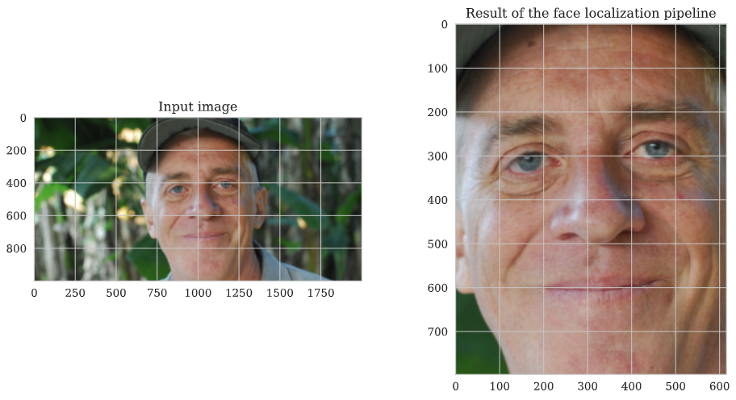
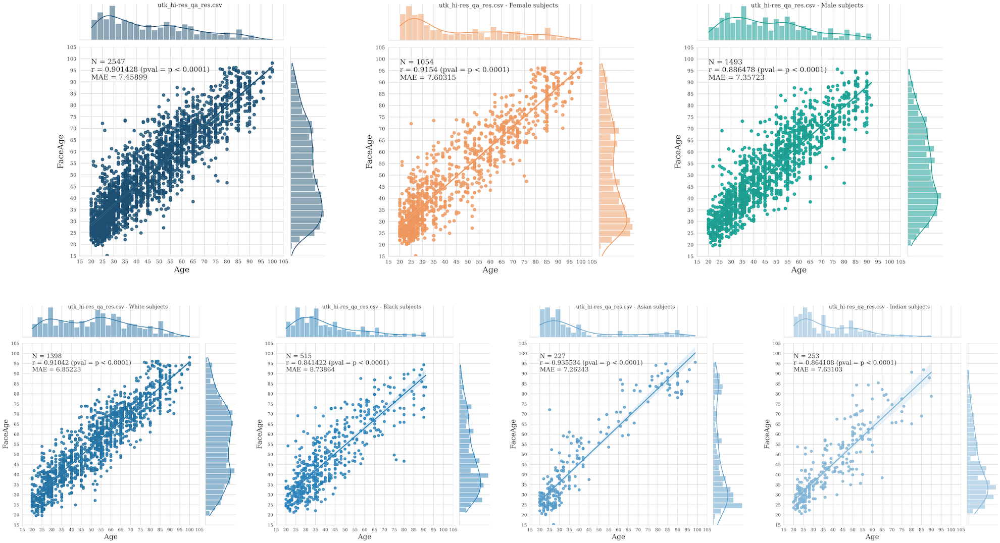

# Notebooks

This folder stores some tutorial notebooks we developed to allow for quick experimentation with our pipeline.

The notebooks can be downloaded and run locally (provided the right environment is set up - see the main `README` for detailed instructions), or opened directly in Google Colab by clicking the "Open with Colab" buttons below.

## Local Notebooks

To run the `data_processing_demo.ipynb` notebook as intended, make sure to set-up a conda environment following the instructions in the `README.md` file (main folder of this repo), and to install `ipynotebook` and `jupyter` as well. 

Make sure you downloaded the FaceAge model weights in the right folder (e.g., in the `models` folder of the GitHub repo). You can do so manually by downloading and moving (the weights file from the GitHub release)[https://github.com/AIM-Harvard/FaceAge/releases/tag/v1], or using the terminal - by running:

```
weights_url = "https://github.com/AIM-Harvard/FaceAge/releases/download/v1/faceage_model.h5"

!wget -O $PATH_TO_FACEAGE_GITHUB_FOLDER/models/faceage_model.h5 $weights_url
```

Finally, you will also need to download some sample data (if you don't have any on your node; for instance, see [this](https://drive.google.com/drive/folders/1OkFc74Izf_2b1kxtGWR7LCiA83-XvJfd?usp=drive_link) Google Drive folder for a curated subset of the UTKFace dataset, or [this one](https://drive.google.com/drive/folders/1xOfTNGGPEmy6HZp0TwiODXVcBsDz1OUR?usp=sharing) for a smaller subset of such folder). By default, data are fetched from the `data` folder in this repository - but this can be changed by modifying the code below.

## Colab Notebooks - ⚠️ Deprecated ⚠️

> [!WARNING]  
> The Colab notebooks are deprecated for the time being (due to some changes in Colab's base image, some packages are not supported anymore). We are working to find a workaround. In the meantime, you are free to try the notebook at `data_processing_demo.ipynb` locally.

### Data Processing Demo

[](https://colab.research.google.com/github/AIM-Harvard/FaceAge/blob/main/notebooks/data_processing_demo.ipynb)

This notebook is designed to showcase how the pipeline is set-up, how to format the input to the pipeline, and what to expect as its output - as well as estimate the computational costs of the operation involved.

The data required to run the notebook will be made available through [Zenodo](https://zenodo) upon publication.


Here follows a sample from the notebook:



```
Age:      62
FaceAge:  63.252663

Gender:   0 (Male)
Race:     0 (White)
```

### Extended Data Plots Demo 

[](https://colab.research.google.com/github/AIM-Harvard/FaceAge/blob/main/notebooks/extended_data_plots_demo.ipynb)

This notebook allows the user to reproduce some of the figures in the Extended Data document.

Note that any small difference in the quantitative results is due to a difference between the versions of the dependencies used to conduct the final analysis in the paper, and the version of such dependencies on Google Colab.

Here follows a sample from the notebook:

<br>




